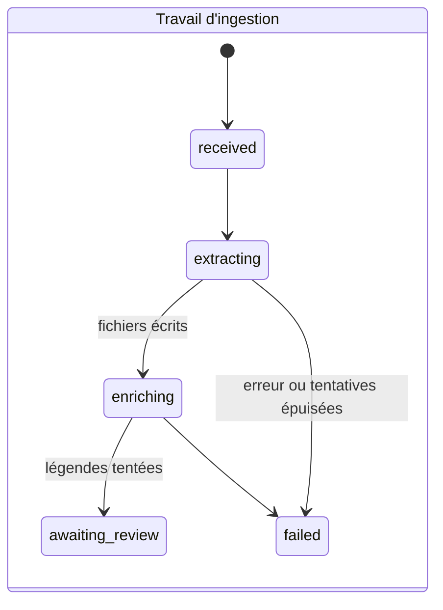
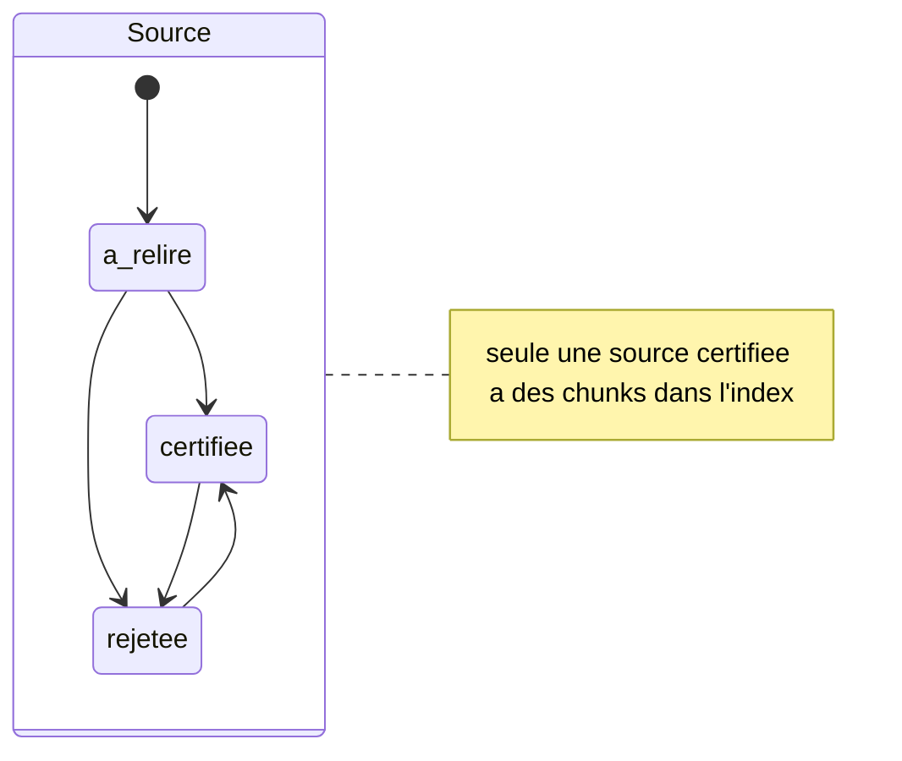
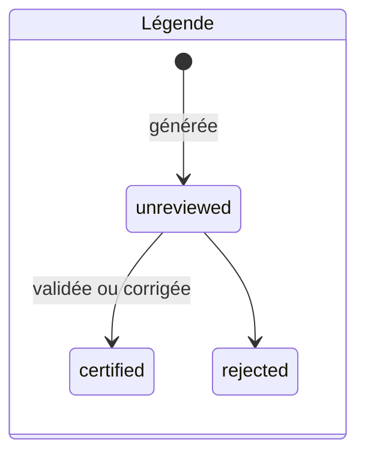
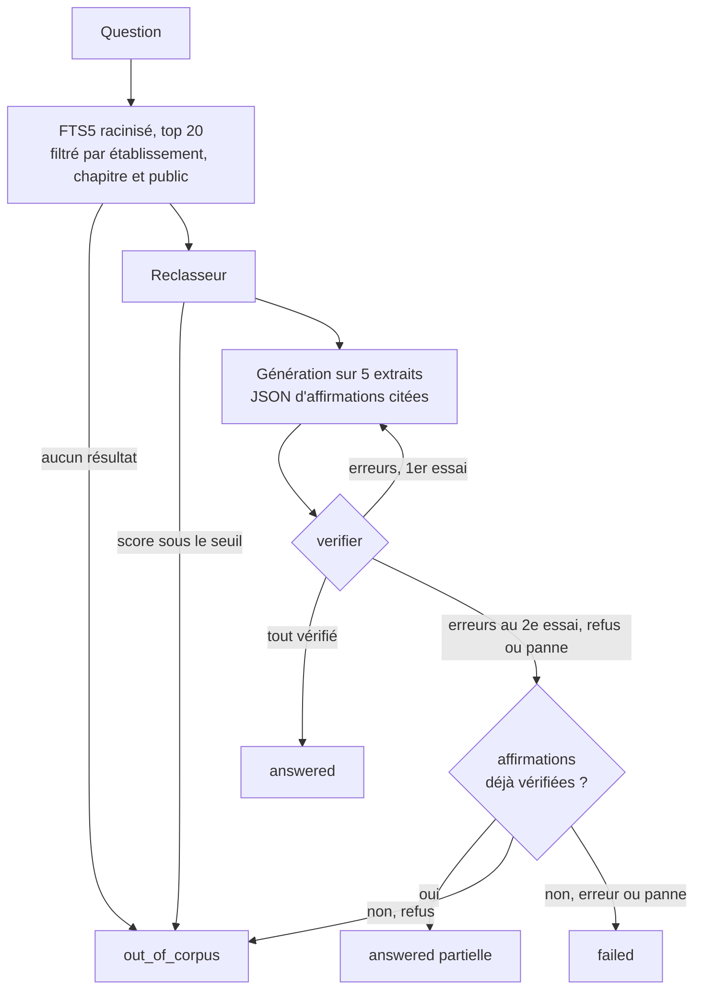

# Architecture

Ce document garde les règles que le code ne dit pas de lui-même. Les routes, le schéma, les
modèles et leurs réglages se lisent dans `src/app/routes.ts`, `migrations/` et
`src/app/config.ts`.

## Règles du produit

1. Une affirmation montrée à un élève cite un passage retrouvé mot pour mot dans une source
   certifiée et ouverte aux élèves. `verifier()` dans `src/core/reponse.ts` le contrôle.
2. Une légende d'image générée et non relue sert à la recherche. Elle ne sert pas de preuve et
   ne s'affiche pas à l'élève. Chaque chunk porte donc deux textes : `rappel` pour la recherche,
   `preuve` pour la citation.
3. Une panne ne ressemble pas à une limite du cours. Une question aboutit à `answered`,
   `out_of_corpus` (rien d'assez proche dans le cours, ou refus du modèle) ou `failed` (panne de
   fournisseur, sortie vide, citations introuvables).
4. Un contenu pédagogique généré (fiche, quiz, page de wiki) reste invisible aux élèves tant
   qu'un enseignant ne l'a pas certifié. Les questions suggérées font exception : le worker ne
   garde que celles auxquelles la chaîne de réponse répond avec des citations vérifiées.
5. Le corpus reste lisible sans l'application. Chaque source vit dans
   `data/content/{source}/` : original, `document.txt`, `blocs.jsonl`, images. L'index de
   recherche se reconstruit depuis ces fichiers par `thot rebuild`.
6. `document.txt` est le système de coordonnées des citations. Les offsets comptent des points
   de code, les chaînes JavaScript des unités UTF-16. Tout découpage passe par
   `src/core/texte.ts`.
7. Le choix d'un modèle est un réglage d'environnement. Il ne traverse pas le domaine.

## Forme du système

Un monolithe Deno lance deux processus depuis le même code : le serveur Hono, qui rend les pages
et calcule les réponses pendant le flux SSE de l'élève, et le worker, qui extrait les documents
et génère légendes et questions suggérées. Ils partagent `state.sqlite3`. La file de travaux est
une table SQLite avec un verrou expirable : un worker tué reprend le travail au redémarrage.

`src/core/` porte l'ingestion, la recherche et la réponse. Il n'importe rien de `src/app/`
(`deno task frontiere`) et reçoit le périmètre des sources consultables en paramètre. Il ne reçoit
ni session ni requête HTTP.

## États

## Réponse à une question

## Règles de travail

- Les tests n'appellent pas de modèle.
- Un changement d'extraction, de découpage, de modèle ou de seuil rejoue l'évaluation concernée
  (`evaluation/`).
- Le corpus de l'établissement reste hors du dépôt. Les fixtures sont petites et autorisées.
- Un échec reste visible avec sa cause. Il ne devient pas un avertissement générique.

## Hors périmètre du pilote

Une instance sert un seul établissement. Restent hors périmètre : index vectoriel approximatif,
contexte complet envoyé au modèle, base ou file distribuée, consensus entre modèles à
l'extraction, recherche web, mode hors ligne, DOCX et PPTX tant que personne n'en dépose.
