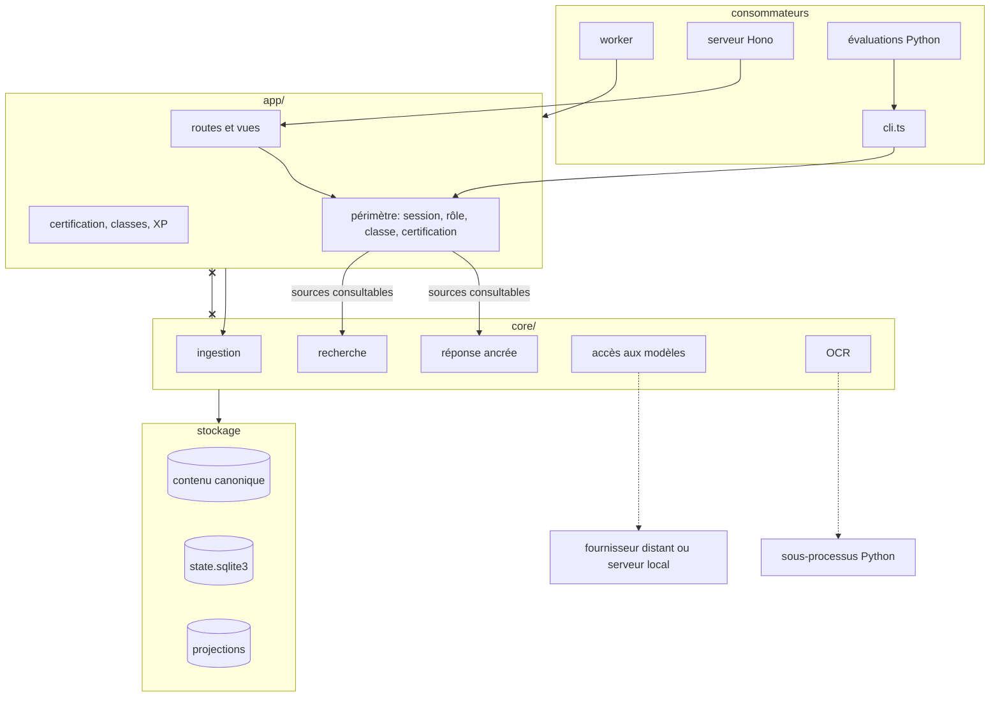

# 0004. Séparer `core/` et `app/` dans un monolithe modulaire

Date: 13/09/2026  
Statut: accepté  
Portée: organisation du code, réutilisation hors du produit scolaire

## Contexte

Thot est open source. D'autres usages sont envisagés: un outil personnel de
connaissances, un outil pour chercheurs et universitaires.
Ils partagent avec le produit scolaire l'ingestion, la recherche et la
réponse avec citations ancrées. Ils remplacent la certification, les
classes, les révisions et la progression.

La réutilisation vient d'abord du contrat de données, déjà spécifié dans
`ARCHITECTURE.md`: `document.txt`, `blocks.jsonl`, `chunks.jsonl`,
`fiche.json` et le répertoire de projection. Un outil qui lit cette
disposition obtient l'ingestion, les citations et la reconstruction sans
partager de code. La séparation du code vient ensuite, pour le jour où une
seconde application existe.

## Décision

Le code applicatif se divise en deux répertoires et un point d'entrée.

```text
src/
  core/      ingestion, recherche, réponse ancrée, accès aux modèles, OCR
             sans HTTP, sans vue, sans session, sans rôle
  app/       routes, vues, worker, certification, classes, révisions, XP
  cli.ts     thot ingest <fichier> / thot ask "<question>" / thot rebuild
```

Une règle: `core/` n'importe rien de `app/`. Une vérification en CI, par
`grep` ou par une règle `deno lint`, la fait respecter. Le CLI est le second
consommateur de `core/`, à côté du serveur. S'il fonctionne sans le serveur,
la frontière tient. Il sert aussi de harnais aux évaluations.



Le trait barré entre `core/` et `app/` est l'import interdit. Les deux
lignes « sources consultables » sont le seul chemin par lequel les règles
d'accès atteignent le moteur.

`core/` ignore les rôles et connaît le périmètre. Chaque fonction de
recherche ou de réponse reçoit en paramètre l'ensemble des sources
consultables, et ce filtre s'applique avant le classement. `app/` calcule ce
périmètre depuis la session, le rôle, la classe et l'état de certification.
Le CLI scolaire obtient le sien par les mêmes fonctions de `app/`, comme le
demande le §13 de l'architecture: il ne contourne pas la certification. Un
CLI hors contexte scolaire construit son propre périmètre, par exemple
toutes les sources d'un répertoire.

Deux points ont aujourd'hui une seconde implémentation et reçoivent une
interface: l'accès aux modèles, fournisseur distant ou serveur local, et
l'OCR, distant ou sous-processus Python. Les autres modules gardent une
seule implémentation jusqu'à l'arrivée d'une seconde.

`core/` reste dans le dépôt. Il est publié comme bibliothèque le jour où une
seconde application l'importe.

## Alternatives considérées

| Option                                                    | Motif de non-sélection                                                                                                                                                       |
| --------------------------------------------------------- | ---------------------------------------------------------------------------------------------------------------------------------------------------------------------------- |
| Microservices par fonction (agent, RAG, OCR)              | Les modules partagent un fichier SQLite et un répertoire de contenu. Un réseau entre eux ajoute du déploiement, des versions et des pannes, sans consommateur qui le demande |
| Paquets séparés dès maintenant (`@thot/rag`, `@thot/ocr`) | Chaque paquet aurait une implémentation et un consommateur. Publier avant le second consommateur fige des interfaces que rien n'a encore exercées                            |
| Aucune frontière, séparation au fil des parcours          | La frontière coûte une règle de lint aujourd'hui. La retrouver après six mois de code mêlé coûte une réécriture                                                              |

## Conséquences

- Le serveur, le worker et le CLI importent `core/` de la même façon. Le
  code métier s'exécute et se teste sans HTTP.
- Les évaluations Python appellent `thot ask` et comparent ses sorties aux
  jeux annotés, sans serveur.
- Chaque fonction de `core/` reçoit ses dépendances et son périmètre en
  paramètre, pas depuis une session ou une requête. `app/` porte donc
  plus de paramètres à chaque appel.
- Une fonction placée dans le mauvais répertoire est une erreur de CI, pas
  un sujet de revue.
- La frontière à deux répertoires ne dit rien de l'intérieur de `core/`.
  Une seconde application dira quelles frontières internes comptent, et
  celles-ci coûteront alors un déplacement de code.
