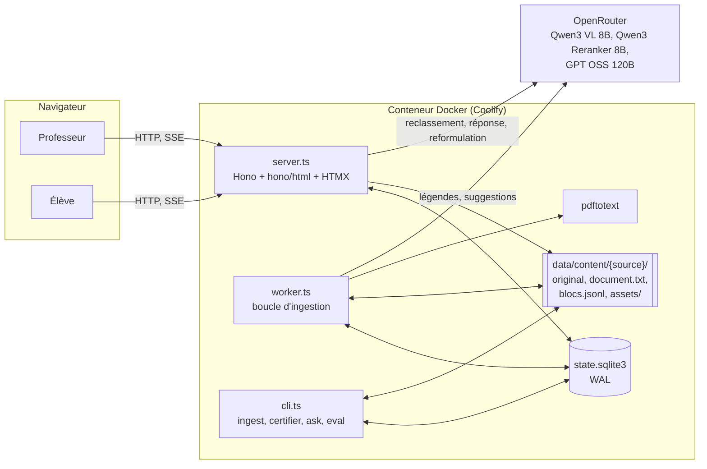
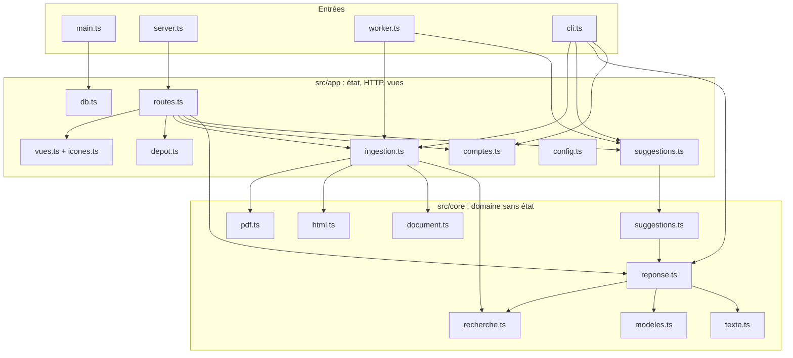
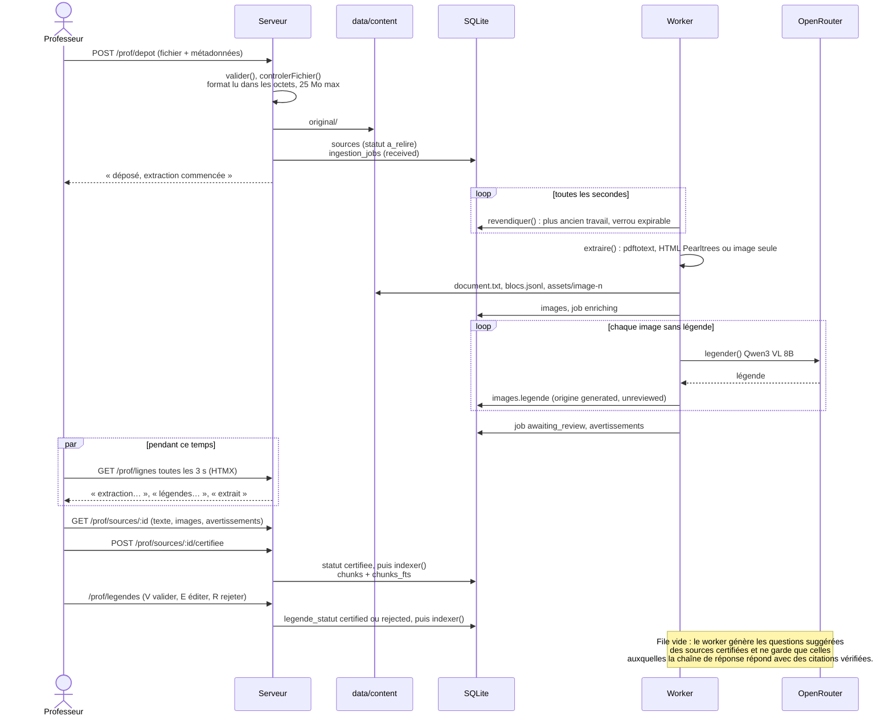
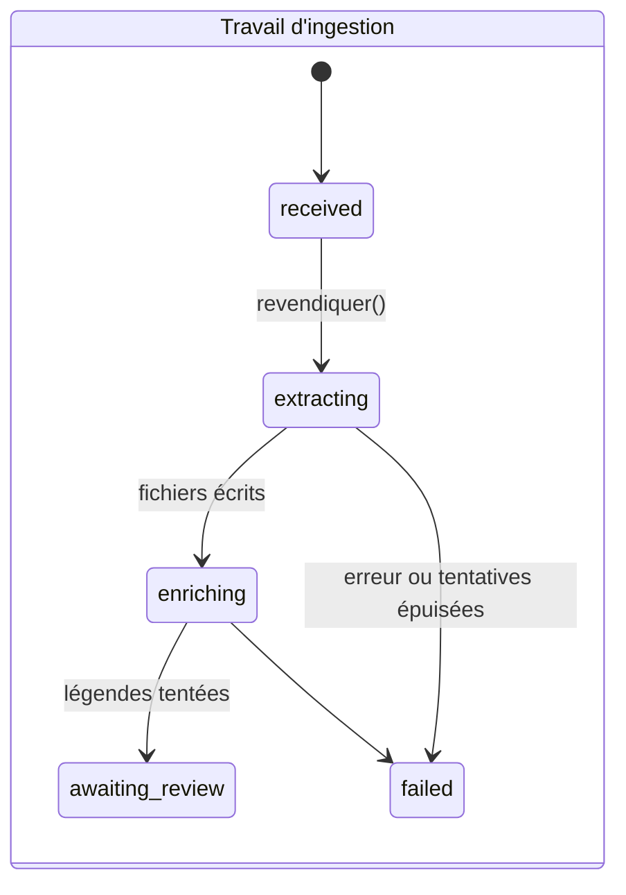
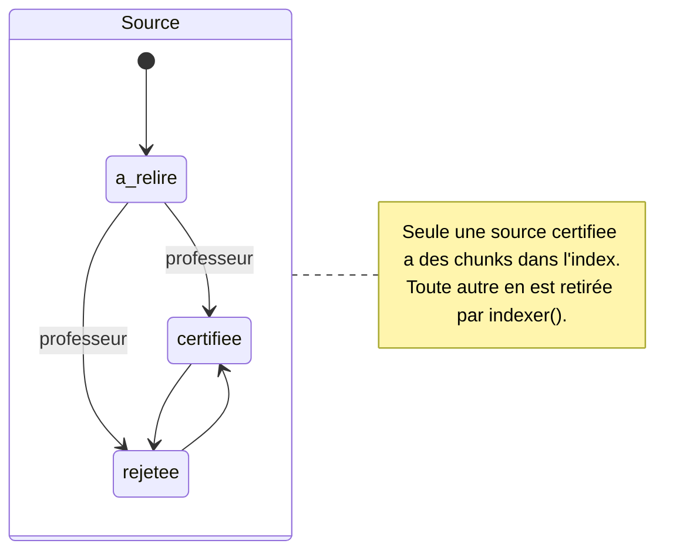
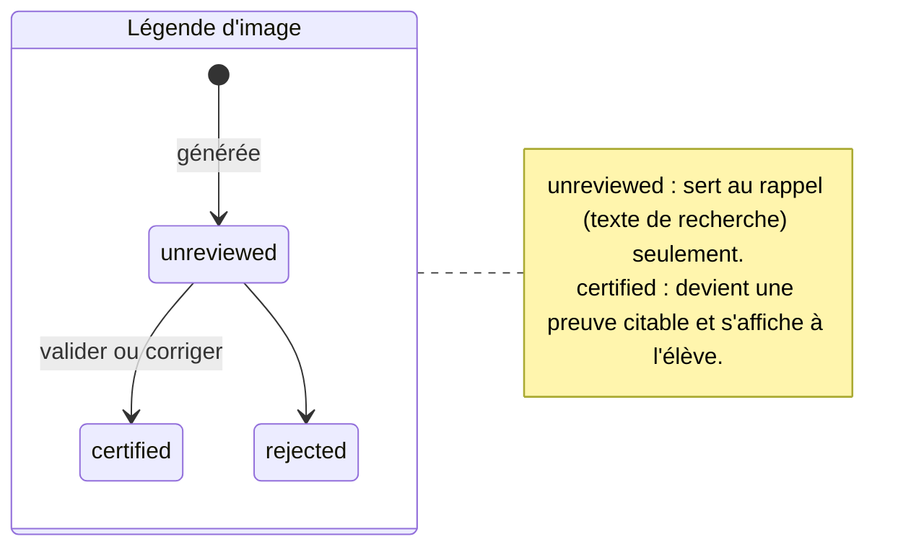
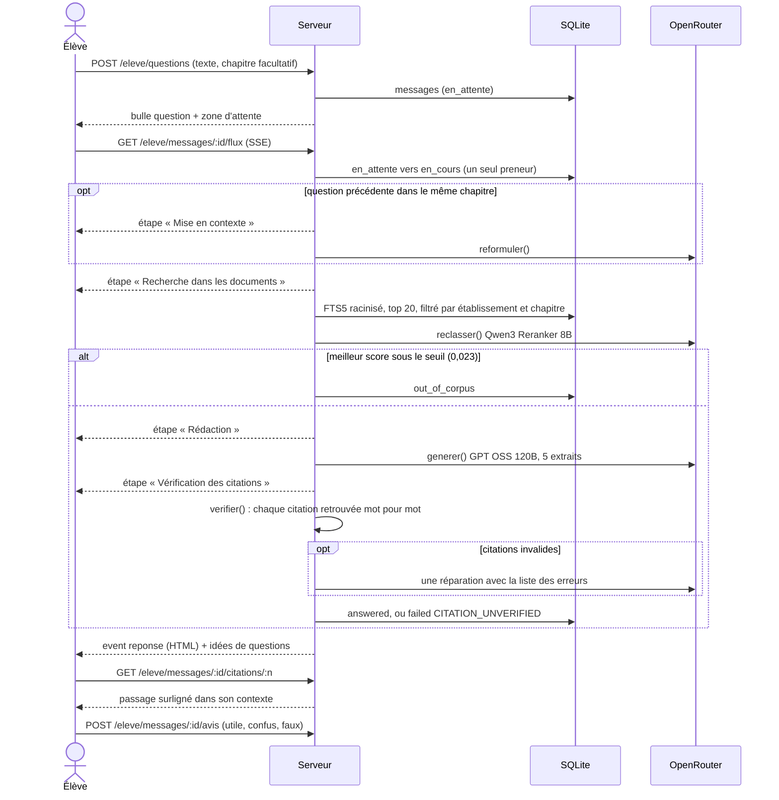
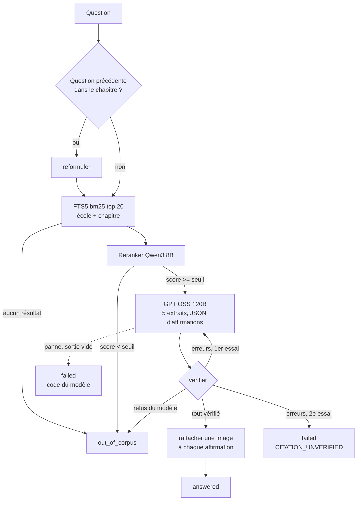
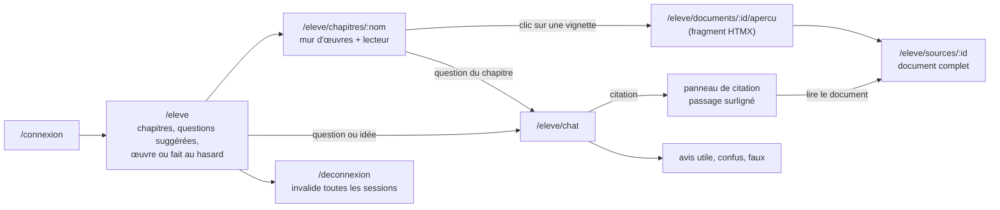
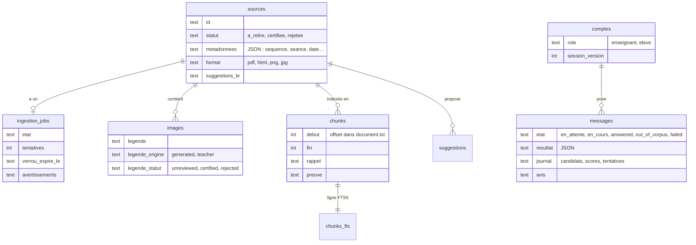

# Thot : diagrammes du code actuel

Ces diagrammes décrivent le code au 23/09/2026. `ARCHITECTURE.md` décrit la cible, qui
diffère encore sur plusieurs points : ni projections, ni embeddings, ni API `/v1`. L'index est
une table FTS5 dans `state.sqlite3`.

## 1. Vue d'ensemble

`src/main.ts` applique les migrations puis lance deux processus Deno depuis le même code. Si
l'un s'arrête, `main.ts` arrête l'autre.

Les deux processus partagent la base SQLite. Le serveur ne lance pas de travail long, à une
exception près : la réponse à une question, calculée pendant le flux SSE de l'élève.

## 2. Modules

`core/` ne dépend pas de `app/`. `deno task check` le vérifie.

## 3. Un professeur dépose un document

## 4. États d'un dépôt

Trois états se croisent : le travail d'ingestion, la source et chaque légende.

## 5. Un élève pose une question

La question est enregistrée, puis le navigateur ouvre un flux SSE. Le premier flux qui prend le
message calcule la réponse. Une reconnexion ou un second onglet attend le résultat en base.

## 6. Recherche, génération, vérification

`demander()` dans `src/core/reponse.ts`. Aucune exception ne sort : une panne devient `failed`,
jamais `out_of_corpus`.

Un chunk porte deux textes. `rappel` contient le contexte, le titre, le texte et toutes les
légendes non rejetées, et sert à la recherche. `preuve` contient le texte et les légendes
certifiées, et c'est le seul texte que `verifier()` accepte comme source d'une citation.

## 7. Parcours élève dans l'interface

Côté professeur : `/prof` (sources, filtres, certification groupée), `/prof/depot`,
`/prof/sources/:id`, `/prof/legendes`, `/prof/questions` (questions des élèves, refus et avis
« faux » en tête), `/prof/eleves` (import de la classe, fiches d'identifiants).

## 8. Données

`cache_modeles` garde les réponses de modèle par empreinte de requête. Le worker purge les
messages plus vieux que `THOT_RETENTION_JOURS` (90 jours par défaut) une fois par heure.
